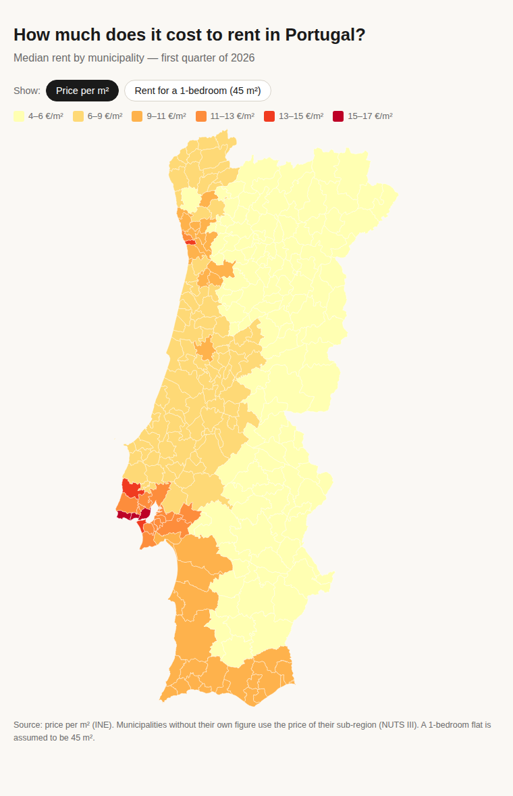

# Portugal Rent Map

An interactive choropleth map and data-journalism piece exploring median rents
across mainland Portugal, built with D3.js.

**Live project:** *add your GitHub Pages link here once you publish*



---

## What I was trying to do

I wanted to understand — and visualise — just how unaffordable renting has
become in Portugal. The numbers are widely reported at a national level, but
the story gets more interesting when you break it down by municipality: some
parts of the country are around €4/m², while Lisbon is over €17/m². I wanted
to make that contrast tangible, and to translate the abstract "price per square
metre" figure into something people can relate to (a monthly rent for a 1-bedroom
flat as a share of the minimum wage).

The output is an article-style page with an interactive map that lets the reader
explore the data themselves.

---

## What I found

- The median rent on a **new lease** in Portugal reached **€9.46 / m²** in Q1
  2026, up 9.1% year-on-year.
- **Lisbon is in a class of its own** at €17.42 / m² — roughly 60–70% above
  the average of other municipalities with enough data. Cascais and Oeiras
  are the next most expensive.
- A one-bedroom flat (45 m²) in Lisbon now costs about **€784 / month** — nearly
  **85% of the national minimum wage** (€920).
- Even in cheaper municipalities, rent exceeds the 30%-of-income affordability
  rule for minimum-wage workers almost everywhere.
- The Algarve is the second-most expensive region, which surprised me — it sits
  close to Lisbon levels, not in the middle of the pack as I'd expected.
- The interior North and Centre regions are dramatically cheaper (€4–5/m²),
  but that's where far fewer jobs are.

---

## Data collection

Data comes from **INE (Statistics Portugal)** — the *Estatísticas das Rendas de
Habitação* (Housing Rent Statistics), published quarterly.

**Steps:**
1. Went to [https://www.ine.pt](https://www.ine.pt) and found the Q1 2026 press
   release for housing rents (search "Rendas de Habitação").
2. Downloaded the accompanying Excel file, which contains median rent per m²
   broken down by NUTS I, II, III and by the ~23 municipalities that had at
   least 100 new lease agreements in the quarter.
3. Parsed and cleaned the file with pandas — see `01_data_collection.ipynb`
   for the full process.
4. The GeoJSON of municipality borders is simplified from the CAOP official
   administrative boundaries (released by the Direção-Geral do Território).

The raw Excel file is in `.gitignore` — you can download it directly from INE
if you want to reproduce the collection notebook.

---

## Analysis overview

See `02_analysis.ipynb` for the full analysis. In brief:

- Split the data by administrative level (NUTS II region, NUTS III sub-region,
  municipality) to look at different geographic scales.
- Compared median rents across NUTS II regions (Norte vs Lisboa vs Algarve etc.)
  and then drilled into individual municipalities.
- Calculated a **rent burden** ratio: T1 rent ÷ minimum wage, to ground the
  numbers in something relatable.
- Looked at the distribution of rents to understand whether there are distinct
  clusters or a smooth gradient.
- Confirmed the key numbers used in the article headline and standfirst.

The main tools were pandas for data manipulation and matplotlib for the
exploratory charts (the final map uses D3.js in the browser).

---

## What I learned / where I grew

- **D3.js from scratch.** I'd never used D3 before this project. Learning how
  `geoPath`, `geoMercator`, and `scaleQuantize` fit together — and why you
  need a local server just to open the file — was a steep but satisfying curve.
- **Working with official statistical data.** INE files are not clean CSVs;
  they have merged cells, multi-row headers, and a hierarchical structure that
  isn't immediately obvious. Learning to inspect a file manually before writing
  the parsing code saved me a lot of frustration.
- **The NUTS classification system.** I hadn't heard of NUTS I/II/III before
  this project and now I can't unsee it — it shows up everywhere in European
  statistics.
- **Handling missing data with a fallback hierarchy.** Not every municipality
  has enough leases to get its own figure, so I implemented a three-level
  fallback (municipality → NUTS III → NUTS II). Getting this logic right in
  both Python and JavaScript was a good exercise.
- **Data journalism framing.** Turning a spreadsheet into something a reader
  cares about — picking the right headline number, building the "85% of minimum
  wage" angle — was harder than the technical work, and more interesting.

---

## Things I wanted to do but didn't get to

- **Time series.** INE has quarterly data going back several years. I'd love to
  show *how fast* rents have risen, not just where they stand now. A small
  animated timeline or a simple line chart alongside the map would make the story
  much richer.
- **Income-adjusted affordability.** I used the national minimum wage as a
  reference, but comparing rents to local median salaries (which vary
  municipality to municipality) would be a more honest affordability measure.
  That data is harder to get at the municipal level.
- **Scraping real listings.** The INE data is the official median — it tells you
  the statistical picture. Scraping actual listings from Idealista or Imovirtual
  would let you see the *asking* price distribution, which is different and
  arguably more relevant to someone actually searching for a flat.
- **Including the islands.** Madeira and the Azores are missing because the
  geojson I found only covers the mainland. Adding them with an inset map would
  make the piece complete.
- **Mobile layout.** The map works on desktop but is a bit awkward on a small
  screen. A proper responsive layout would need a different approach for the
  tooltip (touch events instead of hover).

---

## Running it locally

The page reads `.geojson` and `.csv` with `fetch()`, which browsers block if
you just double-click the HTML. Use a local server:

```bash
python -m http.server 8000
```

Then open <http://localhost:8000>. Stop with `Ctrl + C`.

To run the notebooks:

```bash
pip install pandas openpyxl matplotlib jupyter
jupyter notebook
```

---

## Publishing on GitHub Pages

1. Create a new **public** repository on GitHub.
2. Upload the files so `index.html` is at the **root** (not inside a sub-folder).
3. Go to **Settings → Pages**, set the source to *Deploy from a branch*, branch
   `main`, folder `/ (root)`, and save.
4. After about a minute the site is live at
   `https://<your-username>.github.io/<repository-name>/`.

---

## Files

| File | What it is |
|------|------------|
| `index.html` | The whole app (HTML, CSS and D3 in one file) |
| `portugal_rents.csv` | Cleaned data: zone, level, price per m², estimated 1-bed rent |
| `portugal_municipalities.geojson` | Borders of the 278 mainland municipalities |
| `01_data_collection.ipynb` | How I downloaded and cleaned the INE data |
| `02_analysis.ipynb` | Exploratory analysis and the numbers behind the article |
| `preview.png` | Screenshot used in this README |
| `.gitignore` | Keeps raw Excel files, caches, and system files out of the repo |

---

## Method notes

- 23 municipalities have their own INE figure; the rest inherit the value of
  their NUTS III sub-region. The tooltip in the map says which is which.
- Only mainland Portugal is covered — INE's Q1 2026 release has no
  municipality-level data for the Azores or Madeira.
- The 1-bedroom monthly rent estimate = price per m² × 45 m². This is a rough
  average size for a T1 in Portugal; actual sizes vary.

---

## Credits

- Rent prices: [INE — Estatísticas das Rendas de Habitação](https://www.ine.pt)
- Map geometry: simplified from the CAOP official administrative boundaries
  (Direção-Geral do Território)
- Built with [D3.js v7](https://d3js.org/)
